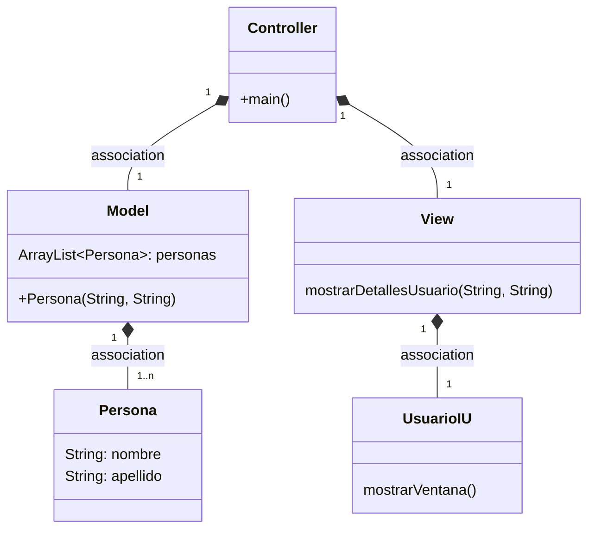
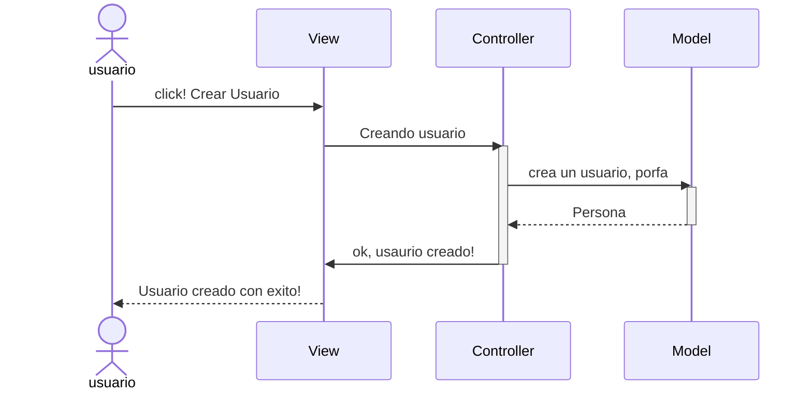

## Diagrama de clases:

```mermaid
classDiagram
    class Persona {
        String: nombre
        String: apellido
       
    }
      class Controller{
          +main()
      }
      class View {mostrarDetallesUsuario(String, String)}
      class Model {
          ArrayList~Persona~: personas
          +Persona(String, String)
         
      }
      
     class UsuarioIU { mostrarVentana() }
    Controller "1" *-- "1" Model : association
    Controller "1" *-- "1" View : association
    Model "1" *-- "1..n" Persona : association
    View "1" *-- "1" UsuarioIU : association
    
      
```

```mermaid

sequenceDiagram
    actor usuario
    participant View
    participant Controller
    participant Model
    
    usuario->>View: click! Crear Usuario
    View->>Controller: Creando usuario
    activate Controller
    Controller->>Model: crea un usuario, porfa
    activate Model
    Model-->>Controller: Persona
    deactivate Model
    Controller->>View: ok, usaurio creado!
    deactivate Controller
    View-->>usuario: Usuario creado con exito!
    
     
```